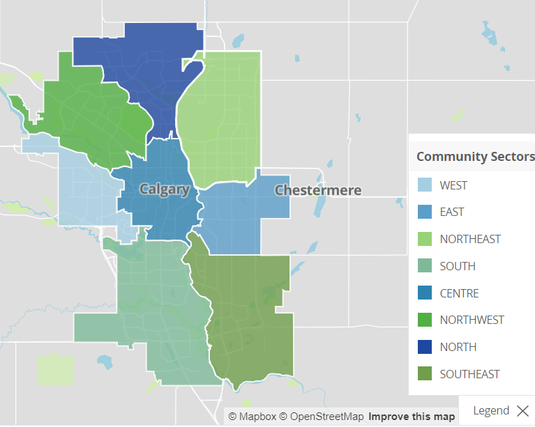

# mode-share-calculator
Simple terminal based transportation mode share calculator in Python.

This program takes travel-to-work data from the City of Calgary, and performs analysis based on user input. This project was completed in Spring 2022 as part of a programming bootcamp class prior to entry in the MEng ENSF program at the University of Calgary.

## Dataset Description
In order to develop the program, City of Calgary data from data.calgary.ca was used. The data used includes the following datasets.
- Civic census 2011 – Modes of Travel to Work [1]
- Civic census 2014 – Modes of Travel to Work [2]
- Civic census 2016 – Modes of Travel to Work [3]
- Communities by Ward [4]

The civic census data includes information relating the neighbourhood to the number of people that travel to work using that mode, based on the results of the census. Communities by Ward includes information relating the neighbourhood to several other values, including the planning sector that the neighbourhood is in, the community structure and development level of the neighbourhood. This was used as the key.
Prior to beginning coding, the datasets were edited for the purposes of data cleaning.
For 2016, 2014, and 2011, data related to the shape and geometry, likely GIS data, of the neighbourhood was removed in order to remove erroneous data that cannot be analyzed in a terminal-based program or matplotlib plots.

For the 2016 and 2014 travel mode data, the following columns were removed as this information contained zeroes as opposed to a value related to percentage, likely due to truncation of the decimal value. 2011 travel mode data did not have this percentage data in its columns.

- Percent travelling by bicycle
- Percent carpooling
- Percent driving to work alone
- Percent travelling by vehicle
- Percent sustainable modes (walk, cycle, transit)
- Percent transit
- Percent walking
  
In addition, 2016 data included information related to people not working:

- number of people not working (nowork in original dataset)
- total number of people including people not working (total)
- total number of people (total_wono)

As the 2011 and 2014 travel mode datasets did not include data on:

- the number of people not working
- the total number of people including people not working

These were removed from the 2016 dataset.
The result of the 2011, 2014, and 2016 data is an excel spreadsheet relating the community to the number of people that travel by the various modes. The 3 spreadsheets include the following columns.

- Community Code
- Community Name
- Community Class
- Bicycle
- Carpool Driver
- Carpool Passenger
- Drove Alone
- Motorcycle
- Transit
- Walk
- Work From Home
- Other
- Total

For each community, each “travel mode” includes the number of people that work and travel by that mode to work. The “Total” represents the sum of the people travelling to work by each mode. The Communities by Ward spreadsheet contains information relating the “Community Code” and “Community Name” by several identifiers, summarized briefly below (information taken from [4], [5]).

- Sector: Planning Sector corresponding to City planning area for facilitating planning, composed of Centre, East, West, North, Northeast, Northwest, South, Southeast, Southwest. A figure from data.calgary.ca is provided as reference [6] as Figure 1.
- SRG: The remaining housing supply in the neighbourhood (Built-Out, Developing, Non-Residential, N/A.)
- COMM_STRUCTURE: Demographic model, corresponding to year where majority of community peak population is in place (1950s, 1960s/1970s, 1970s/1980s, 1980s/1990s, 1990s/2000s, 2000s, Building Out, Centre City, Employment, Inner City, Other, Undeveloped)
- Community Class: Land use of the neighbourhood (Industrial, Residential, etc). A corresponding Community Class Code corresponding a numerical value to each land use was removed as it was seen to be redundant.
- Community Name: Full name of the community.
- Community Code: Three-character code that corresponds to the community name.
- Ward: The ward that the community is located in.

As part of the process of determining if this dataset was suitable, the Community Code in the Communities by Ward spreadsheet was checked against the Community Codes in the 2016 travel mode dataset to ensure that the latest travel mode data could be used. As a result, the data was edited to remove erroneous data related to neighbourhoods that have no corresponding mode share data in 2016, corresponding to industrial, commercial areas with no residents or neighbourhoods built since 2016 that did not exist prior.

City of Calgary Planning Sectors (Source: [6])



## How to Run
To run the script, type in a terminal with Python 3.9 or higher installed, with Python added to the PATH:
```
python mode_share.py
```
The program will extract civic census data from the "City of Calgary Mode Share" folder in the repo. You will be prompted for a "Planning Sector" from a provided list, the a "Travel Mode" from a list of modes. Inputs are case sensitive. The program will then provide you with an output in the terminal window, an Excel file with the outputs called "mode_share_data", and a graph of the Citywide mode share for that travel mode compared to the selected planning sector, and the mode share proportion by sector and year, before terminating

## Sample Runs
Below are sample run screenshots of the program running:

### User Input


### Outputs

#### Data Description


#### Population


#### Mode Share


#### Additional Stats


### Graphs

#### Sector to Citywide Mode Share


#### Mode Share by Sector and Year


## References
[1] Civic census 2011 – Modes of Travel to Work, Apr. 2020. [Online]. Available: https://data.calgary.ca/Transportation-Transit/Civic-census-2011-Modes-of-Travel-to-Work/7tad-i2m6

[2] Civic census 2014 – Modes of Travel to Work, Apr. 2020. [Online]. Available: https://data.calgary.ca/Transportation-Transit/Civic-census-2014-Modes-of-Travel-to-Work/u7sr-kvzj

[3] Civic census 2016 - Modes of Travel to Work, Mar. 2022. [Online]. Available: https://data.calgary.ca/Transportation-Transit/Civic-census-2016-Modes-of-Travel-to-Work/7ta2-pupq

[4] Communities by Ward, Sep. 2020. [Online]. Available: https://data.calgary.ca/Government/Communities-by-Ward/jd78-wxjp

[5] Census by Community 2016, Apr. 2020. [Online]. Available: https://data.calgary.ca/Demographics/Census-by-Community-2016/hfwb-eab8

[6] Community Sectors Map, Jan. 2022. [Online]/ Available: https://data.calgary.ca/Base-Maps/Community-Sectors-Map/pai2-tsju
